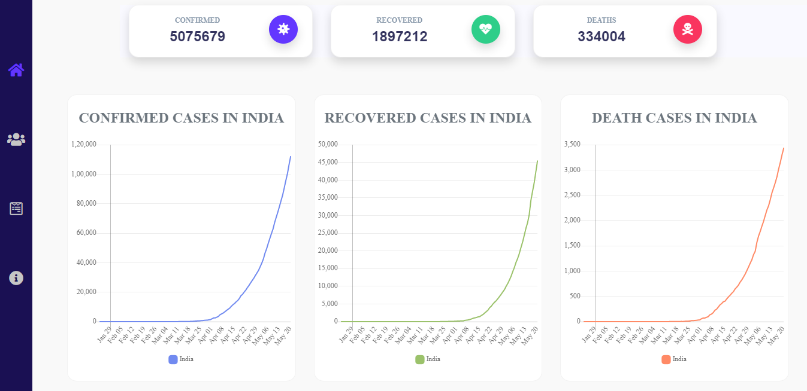
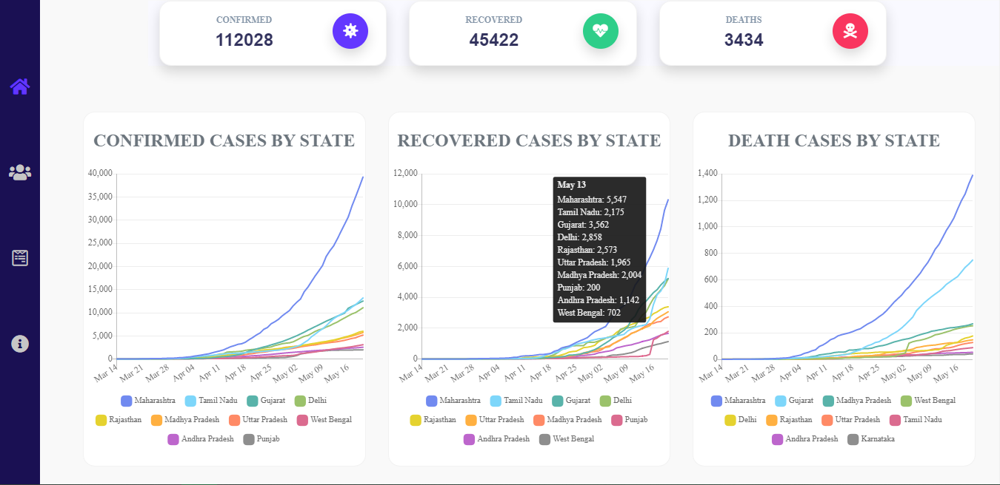
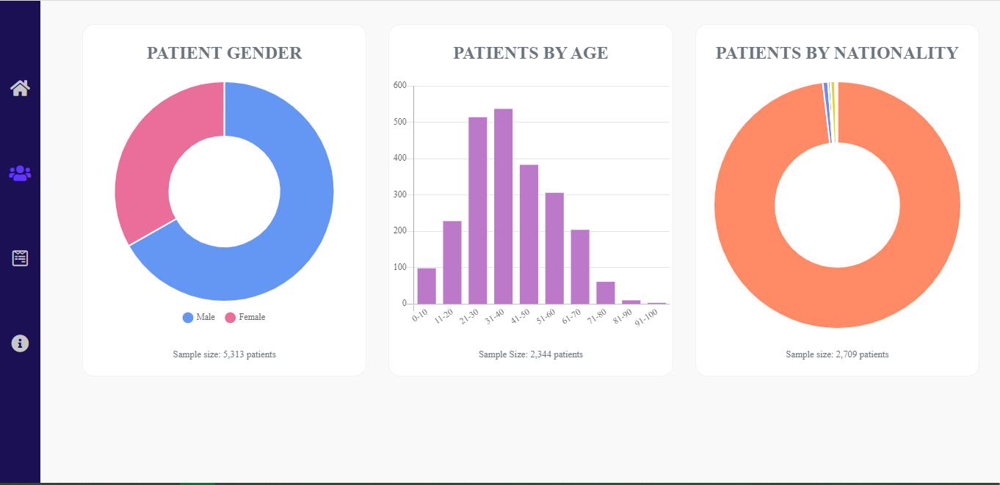
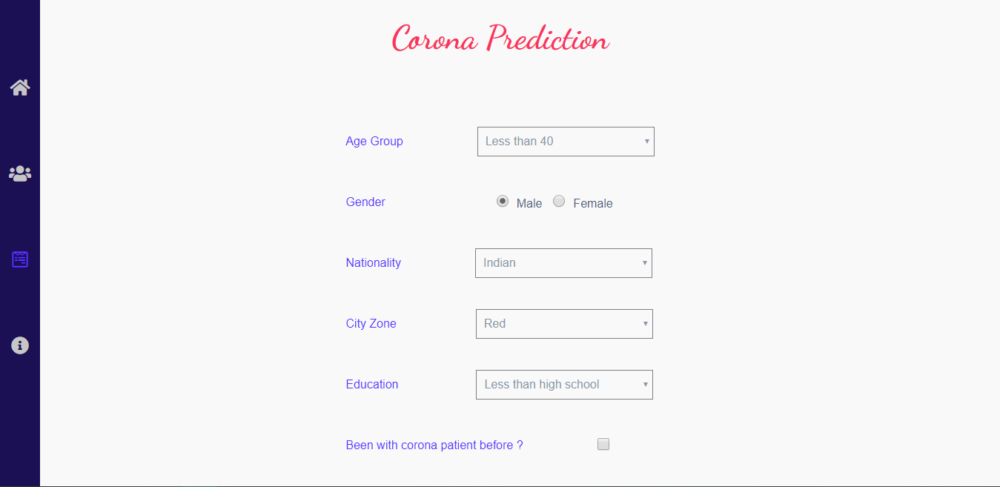
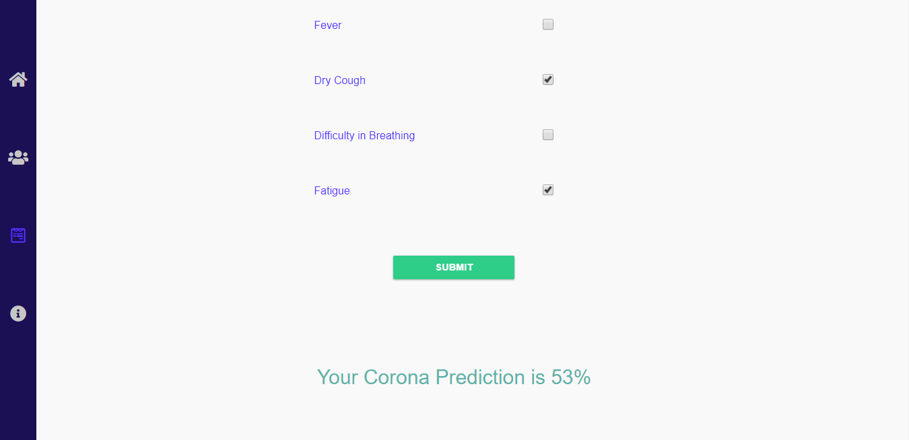

A Django-React Project which aims to provide data analysis and easy data visualization for the confirmed, recovered and death cases of covid. Also user will be provided with the prediction score of getting corona on the basis of some parameters like user location, health situation etc 

Project view

home_view_00

home_view_01

patient_info_view_00

prediction_form_view_00

prediction_form_view_01

